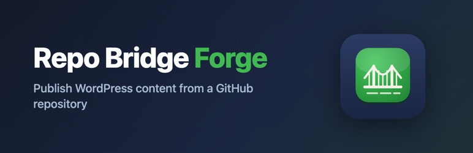

<p align="center">
  
</p>

<h1 align="center">Repo Bridge Forge</h1>

<p align="center">
  <strong>Publish your WordPress content straight from a GitHub repository.</strong><br>
  Write in Markdown, keep it under version control, and let your posts stay in sync from the branch you choose.
</p>

<p align="center">
  <a href="https://github.com/gunjanjaswal/RepoBridgeForge/actions/workflows/ci.yml"></a>
  
  
  
  
</p>

<p align="center">
  
  
  
  
  <a href="https://ko-fi.com/gunjanjaswal"></a>
</p>

---

<p align="center">
  <a href="#what-it-does">What it does</a> ·
  <a href="#features-at-a-glance">Features</a> ·
  <a href="#how-it-works">How it works</a> ·
  <a href="#a-sample-file">Sample file</a> ·
  <a href="#installation">Install</a> ·
  <a href="#setup">Setup</a> ·
  <a href="#configuration">Configuration</a> ·
  <a href="#frequently-asked-questions">FAQ</a> ·
  <a href="#roadmap">Roadmap</a>
</p>

---

## What it does

Repo Bridge Forge reads Markdown files from a GitHub repository and turns them into WordPress posts. Point it at a repo, a branch, and a folder, and every Markdown file there becomes a post. Edit a file on GitHub, and the matching post updates on the next sync.

It fits three kinds of people well:

- You like writing in Markdown and would rather not touch the WordPress editor.
- You want your content under version control, with history and pull requests.
- You manage docs, release notes, or a changelog in a repo and need them mirrored onto a WordPress site.

## Features at a glance

| | Feature | What you get |
| :---: | --- | --- |
| 📝 | **Markdown to posts** | Every `.md` file in your chosen folder becomes a WordPress post, converted to clean HTML |
| 🧭 | **Front matter mapping** | YAML front matter sets the title, slug, status, type, date, categories, and tags |
| 🔒 | **Read-only by design** | The plugin only ever reads from GitHub. Your repo is never written to or changed |
| 🔑 | **Fine-grained tokens** | Works with a single-repo, read-only personal access token, stored encrypted at rest |
| 🎯 | **Smart change detection** | Each file is tracked by its Git blob checksum, so unchanged files are skipped |
| ⏱ | **Manual or scheduled** | Sync on demand, or on a WP-Cron schedule from every 15 minutes to once a day |
| 🗂️ | **Folder scoping** | Sync the whole repo, or narrow it to a single sub-folder |
| 🧹 | **Deletion handling** | When a file disappears, leave the post in place and log it, or move it to Trash |
| 📋 | **Activity log** | See what synced, what was skipped, and what went wrong, right on the settings screen |
| 🪶 | **Zero dependencies** | A small built-in Markdown converter, no Composer, no build step, no bundled libraries |

## Why one direction

Your repository is the source of truth. WordPress is where it gets published. Repo Bridge Forge only reads from GitHub, it never writes back, so there is nothing to reconcile and no chance of the plugin changing your repo. That decision keeps the whole thing predictable: if the file changed, the post changes; if it did not, nothing happens.

## How it works

```
  GitHub repo (Markdown + front matter)
            │
            │  read-only, over the GitHub REST API
            ▼
  Repo Bridge Forge  ──►  parse front matter  ──►  convert Markdown to HTML
            │
            ▼
  WordPress posts  (tracked per file by its Git blob checksum)
```

Each file is tracked by its Git blob SHA, stored in post meta. On every run Repo Bridge Forge compares the current SHA against the last one it saw, so unchanged files are skipped and only real edits trigger an update. No content diffing, no guesswork.

## A sample file

Front matter drives the post. Everything below it is the body.

```markdown
---
title: "Getting Started"
slug: getting-started
status: publish
type: post
categories: [Guides, Tutorials]
tags:
  - setup
  - intro
excerpt: A short intro that becomes the post excerpt.
date: 2026-08-14
---

# Getting Started

Your **Markdown** body goes here, including lists, links, and code.
```

### Front matter reference

| Key | Maps to | Notes |
| --- | --- | --- |
| `title` | Post title | Falls back to the first `#` heading, then the filename |
| `slug` | Post slug | Optional |
| `status` | Post status | `publish`, `draft`, `pending`, `private`. Defaults to the plugin setting |
| `type` | Post type | Any registered public type. Defaults to the plugin setting |
| `categories` | Categories | Inline `[A, B]` or a block list. Created if missing |
| `tags` | Tags | Inline or block list |
| `excerpt` | Post excerpt | Optional |
| `date` | Publish date | Any format PHP can parse |

## Installation

### From the WordPress plugin directory

1. In your dashboard, go to **Plugins → Add New** and search for **Repo Bridge Forge**.
2. Install and activate.

### Manual

1. Download the latest release zip.
2. **Plugins → Add New → Upload Plugin**, choose the zip, install, and activate.

### For development

```bash
git clone https://github.com/gunjanjaswal/RepoBridgeForge.git wp-content/plugins/repobridgeforge
```

Repo Bridge Forge uses a small built-in Markdown converter, so it has no third-party dependencies and runs as-is.

## Setup

1. Go to **Tools → Repo Bridge Forge**.
2. Enter the repository owner, name, branch, and an optional folder path.
3. Paste a fine-grained personal access token with read-only Contents access to that repository.
4. Choose the post type, default status, and how often to sync.
5. Click **Test connection**, then **Sync now**.

### The token

Repo Bridge Forge needs a [fine-grained personal access token](https://github.com/settings/tokens?type=beta) scoped to the one repository, with **Contents: Read-only**. That is the least access the plugin can work with. The token is stored encrypted in your database.

## Configuration

| Setting | What it controls |
| --- | --- |
| Owner / Repository / Branch | Where content is read from |
| Folder path | Limit syncing to a sub-folder, or leave empty for the repo root |
| Post type | Default type for imported files |
| Default status | Status used when a file omits `status` |
| Automatic sync | Manual, every 15 minutes, hourly, twice daily, or daily (via WP-Cron) |
| When a file is deleted | Leave the post untouched (log only), or move it to Trash |

## Frequently asked questions

**Does it write my WordPress posts back to GitHub?**
No. Version 0.1 is read-only from GitHub to WordPress. Your repo is never modified.

**What happens when I delete a file from the repo?**
By default the matching post is left alone and the event is logged. You can switch to moving that post to Trash in the settings.

**Does it work with the block editor and page builders?**
Content is stored as HTML in the post body, which the block editor and any theme read fine. Builders that keep their own layout data, such as Elementor or WPBakery, own the editing surface for a page, so synced content shows as standard content rather than editable builder modules.

**Is my token safe?**
It is stored encrypted at rest using your site's authentication salts, and it never leaves your server except in calls to the GitHub API.

**Do I need Composer or a build step?**
No. Markdown is converted by a small built-in converter in `includes/class-markdown.php`, so the plugin ships with no third-party dependencies.

## External services

Repo Bridge Forge talks to the [GitHub REST API](https://docs.github.com/rest) (`https://api.github.com`) to read the repository you configure. Requests are made only after you save a repository and token, and only to fetch the repository details, its file tree, and the contents of Markdown files. Nothing is sent anywhere else, and the plugin collects no analytics.

- [GitHub Terms of Service](https://docs.github.com/site-policy/github-terms/github-terms-of-service)
- [GitHub Privacy Statement](https://docs.github.com/site-policy/privacy-policies/github-privacy-statement)

## Roadmap

| Version | Status | Focus |
| --- | :---: | --- |
| **0.1** | ✅ Shipped | One-way pull, PAT auth, manual and scheduled sync, front matter mapping, change detection, activity log |
| **0.2** | 🛠️ Planned | Push webhooks for instant sync; WordPress to GitHub export; image and asset handling |
| **0.3** | 💡 Exploring | Optional GitHub App and Marketplace listing; multi-repo; block-based rendering |

## Development

See [CONTRIBUTING.md](CONTRIBUTING.md) for local setup, coding standards, the versioning scheme, and the release process.

```bash
# lint every PHP file
find . -name '*.php' -not -path './vendor/*' -print0 | xargs -0 -n1 php -l
```

## Contributing

Issues and pull requests are welcome at [github.com/gunjanjaswal/RepoBridgeForge](https://github.com/gunjanjaswal/RepoBridgeForge). If you are reporting a bug, a sample Markdown file and your settings help a lot.

## License

GPL-2.0-or-later. See [LICENSE](LICENSE).

## Author

Built by **Gunjan Jaswal**.

- Website: [gunjanjaswal.me](https://www.gunjanjaswal.me)
- Email: [hello@gunjanjaswal.me](mailto:hello@gunjanjaswal.me)
- Support the work: [ko-fi.com/gunjanjaswal](https://ko-fi.com/gunjanjaswal)
